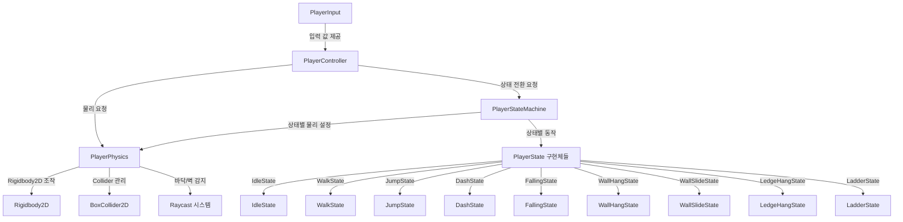

# 플레이어 이동 시스템 아키텍처

2D 플랫포머 게임의 플레이어 이동 시스템 클래스 분리 및 상태 머신 설계 문서입니다.

## 개요

이 문서는 플레이어 이동 시스템의 클래스 분리 구조와 상태 머신 설계를 설명합니다. 관심사 분리(Separation of Concerns) 원칙을 따라 각 클래스의 책임을 명확히 하고, 상태 머신을 통해 복잡한 이동 상태를 관리합니다.

설계 원칙과 구현 세부사항은 다음 문서를 참조하세요:

- [PlayerMovement-Design.md](./PlayerMovement-Design.md) - 설계 원칙 및 아키텍처
- [PlayerMovement-Implementation.md](./PlayerMovement-Implementation.md) - 구현 세부사항

## 현재 구조의 문제점

### PlayerController

- **입력 처리** + **로직 조율** + **모델 방향 업데이트**가 혼재
- Unity Input API에 직접 의존하여 테스트 및 교체가 어려움
- 입력 처리 로직이 복잡해짐에 따라 유지보수가 어려워짐

### PlayerPhysics

- **물리 처리** + **상태 관리** + **로직 실행**이 혼재
- 점프, 대시, 아래 점프 등 다양한 이동 기능의 상태 관리가 복잡함
- 향후 벽 매달리기, 난간 매달리기, 사다리 등 추가 기능 확장 시 복잡도 증가

## 제안하는 클래스 분리 구조

### 전체 아키텍처



### 클래스 계층 구조

1. **PlayerInput** - 입력 처리 계층
2. **PlayerController** - 로직 조율 계층
3. **PlayerStateMachine** - 상태 관리 계층
4. **PlayerState** (인터페이스/추상 클래스) - 상태 베이스
5. **각 상태별 클래스** - 상태 구현체
6. **PlayerPhysics** - 물리 처리 계층

## 클래스 상세 설계

### 1. PlayerInput

**책임**: Unity Input API 래핑, 입력 값만 읽어서 반환

**주요 기능:**

- Unity Input API를 추상화하여 입력 시스템 교체 용이성 확보
- 입력 값만 읽어서 프로퍼티로 제공
- 입력 처리 로직은 포함하지 않음

**공개 API:**

```csharp
public class PlayerInput : MonoBehaviour
{
    // 수평 이동 입력 (-1.0 ~ 1.0)
    public float HorizontalInput { get; private set; }

    // 수직 이동 입력 (-1.0 ~ 1.0)
    public float VerticalInput { get; private set; }

    // 점프 입력 (한 프레임만 true)
    public bool IsJumpPressed { get; private set; }

    // 점프 키 해제 (한 프레임만 true)
    public bool IsJumpReleased { get; private set; }

    // 아래 방향 키 입력 상태
    public bool IsDownInputPressed { get; private set; }

    // 대시 입력 (한 프레임만 true)
    public bool IsDashPressed { get; private set; }

    public void LogicUpdate()
    {
        // 입력 읽기만 수행 (PlayerController의 Update에서 호출)
        HorizontalInput = Input.GetAxis("Horizontal");
        VerticalInput = Input.GetAxis("Vertical");
        IsDownInputPressed = Input.GetKey(KeyCode.S) || Input.GetKey(KeyCode.DownArrow);
        IsJumpPressed = Input.GetKeyDown(KeyCode.Space);
        IsJumpReleased = Input.GetKeyUp(KeyCode.Space);
        IsDashPressed = Input.GetKeyDown(KeyCode.LeftShift);
    }
}
```

**장점:**

- Unity Input System으로 전환 시 이 클래스만 수정하면 됨
- 테스트 시 Mock 객체로 교체 가능
- 입력 처리 로직이 한 곳에 집중됨

### 2. PlayerController

**책임**: 입력을 받아서 상태 머신과 연동, 로직 조율, 모델 방향 업데이트

**주요 기능:**

- `PlayerInput`에서 입력 값 받기
- 입력 기반 로직 처리 (점프, 대시, 아래 점프 등)
- 상태 머신에 상태 전환 요청
- 모델 방향 업데이트
- 이동 속도 계산 및 `PlayerPhysics`에 전달

**공개 API:**

```csharp
public class PlayerController : MonoBehaviour
{
    [SerializeField] private float _moveSpeed = 5f;

    private PlayerInput _input;
    private PlayerStateMachine _stateMachine;
    private PlayerPhysics _physics;
    private Transform _modelTransform;

    private void Awake()
    {
        _input = GetComponent<PlayerInput>();
        _stateMachine = GetComponent<PlayerStateMachine>();
        _physics = GetComponent<PlayerPhysics>();
        SetupModel();
    }

    private void Update()
    {
        // 1. 입력 업데이트 (가장 먼저)
        _input.LogicUpdate();

        // 2. 상태 머신 업데이트 (입력 처리 및 상태 전환)
        _stateMachine.LogicUpdate();

        // 3. 아래 점프 처리 (상태 머신을 거치지 않고 직접 처리)
        if (_input.IsJumpPressed && _input.IsDownInputPressed)
        {
            _physics.RequestDownJump();
        }

        // 4. 점프 키 해제 처리 (가변 점프)
        if (_input.IsJumpReleased && !_input.IsDownInputPressed)
        {
            _physics.ReleaseJump();
        }

        // 5. Model 스프라이트 방향 반전
        UpdateModelDirection();
    }

    private void FixedUpdate()
    {
        // 1. 물리 시스템 업데이트 (바닥 감지, 대시 처리 등)
        _physics.PhysisUpdate();

        // 2. 상태 머신 FixedUpdate
        _stateMachine.PhysisUpdate();

        // 3. 이동 속도 적용 (대시 중일 때는 일반 이동 입력 무시)
        if (!_physics.IsDashing)
        {
            float targetVelocityX = _input.HorizontalInput * _moveSpeed;
            _physics.ApplyHorizontalVelocity(targetVelocityX);
        }
    }

    private void UpdateModelDirection()
    {
        if (_modelTransform == null) return;

        // 입력값이 0이 아니면 방향 변경, 0이면 이전 방향 유지
        if (Mathf.Abs(_input.HorizontalInput) > 0.01f)
        {
            Vector3 scale = _modelTransform.localScale;
            scale.x = _input.HorizontalInput > 0 ? 1f : -1f;
            _modelTransform.localScale = scale;
        }
    }
}
```

**주요 특징:**

- Unity의 `Update`/`FixedUpdate` 이벤트는 `PlayerController`에서만 사용
- 다른 클래스들은 `LogicUpdate()`/`PhysisUpdate()` 메서드로 호출
- 명시적인 업데이트 순서 제어 가능

### 3. PlayerStateMachine

**책임**: 상태 전환 관리, 상태별 업데이트 호출

**주요 기능:**

- 상태 전환 조건 검사
- 상태 전환 시 이전 상태 Exit → 새 상태 Enter 순서 보장
- 상태별 업데이트 호출
- 상태 전환 중복 방지

**상태 열거형:**

```csharp
public enum PlayerState
{
    None,
    Idle,
    Walk,
    Jumping,
    Falling,
    Dash
    // 향후 확장: WallHang, WallSlide, LedgeHang, Ladder
}
```

**현재 구현 상태:**

- ✅ Idle: 정지 상태
- ✅ Walk: 걷기 상태
- ✅ Jumping: 점프 상태
- ✅ Falling: 낙하 상태
- ✅ Dash: 대시 상태
- ⏳ WallHang: 벽 매달리기 (미구현)
- ⏳ WallSlide: 벽 미끄러지기 (미구현)
- ⏳ LedgeHang: 난간 매달리기 (미구현)
- ⏳ Ladder: 사다리 (미구현)

**공개 API:**

```csharp
public class PlayerStateMachine : MonoBehaviour
{
    public PlayerState CurrentState { get; private set; }

    private Dictionary<PlayerState, IPlayerState> _states;
    private PlayerPhysics _physics;
    private PlayerInput _input;
    private PlayerController _controller;

    private void Awake()
    {
        _physics = GetComponent<PlayerPhysics>();
        _input = GetComponent<PlayerInput>();
        _controller = GetComponent<PlayerController>();
        InitializeStates();
    }

    private void InitializeStates()
    {
        _states = new Dictionary<PlayerState, IPlayerState>
        {
            { PlayerState.Idle, new IdleState(this, _physics, _input) },
            { PlayerState.Walk, new WalkState(this, _physics, _input) },
            { PlayerState.Jumping, new JumpState(this, _physics, _input) },
            { PlayerState.Falling, new FallingState(this, _physics, _input) },
            { PlayerState.Dash, new DashState(this, _physics, _input) }
            // 향후 확장: WallHang, WallSlide, LedgeHang, Ladder
        };

        // 초기 상태 설정
        ChangeState(PlayerState.Idle);
    }

    public void LogicUpdate()
    {
        // 입력 처리 (상태 전환보다 먼저 처리)
        HandleInput();

        // 현재 상태 업데이트
        if (_states.TryGetValue(CurrentState, out IPlayerState currentState))
        {
            currentState.OnUpdate();
        }
    }

    private void HandleInput()
    {
        // 점프 입력 감지 (아래 방향 키가 눌려있지 않으면 일반 점프)
        if (_input.IsJumpPressed && !_input.IsDownInputPressed)
        {
            RequestJump();
        }

        // 대시 입력 감지
        if (_input.IsDashPressed)
        {
            Vector2 dashDirection = CalculateDashDirection();
            RequestDash(dashDirection);
        }
    }

    private Vector2 CalculateDashDirection()
    {
        // 대시 방향 계산
        if (Mathf.Abs(_input.HorizontalInput) > 0.01f)
        {
            return _input.HorizontalInput > 0 ? Vector2.right : Vector2.left;
        }

        // 입력이 없는 경우: Model Transform의 스케일 x 값 기준
        Transform modelTransform = _controller.transform.Find("Model");
        if (modelTransform != null)
        {
            return modelTransform.localScale.x > 0 ? Vector2.right : Vector2.left;
        }

        return Vector2.right;
    }

    public void PhysisUpdate()
    {
        // 현재 상태 FixedUpdate
        if (_states.TryGetValue(CurrentState, out IPlayerState currentState))
        {
            currentState.OnFixedUpdate();
        }
    }

    public void ChangeState(PlayerState newState)
    {
        if (CurrentState == newState) return;

        // 이전 상태 Exit
        if (_states.TryGetValue(CurrentState, out IPlayerState previousState))
        {
            previousState.OnExit();
        }

        // 새 상태 Enter
        CurrentState = newState;
        if (_states.TryGetValue(CurrentState, out IPlayerState nextState))
        {
            nextState.OnEnter();
        }
    }

    public void RequestJump()
    {
        // 점프 요청 처리 (상태별로 다르게 처리)
        if (_states.TryGetValue(CurrentState, out IPlayerState currentState))
        {
            currentState.OnJumpRequested();
        }
    }

    public void RequestDash(Vector2 direction)
    {
        // 대시 요청 처리
        if (_states.TryGetValue(CurrentState, out IPlayerState currentState))
        {
            // 현재 상태가 Dash가 아니면 Dash 상태로 전환하고 대시 실행
            if (CurrentState != PlayerState.Dash)
            {
                ChangeState(PlayerState.Dash);
                _physics.RequestDash(direction);
            }
            else
            {
                // 이미 Dash 상태이면 무시
                currentState.OnDashRequested(direction);
            }
        }
    }

    private void OnDrawGizmos()
    {
        // 플레이어 위치 위에 현재 상태 표시 (에디터에서만)
        Vector3 position = transform.position + Vector3.up;
        string stateText = $"State: {CurrentState}";
        // Handles.Label로 표시
    }
}
```

**주요 특징:**

- `LogicUpdate()`: `PlayerController.Update()`에서 호출, 입력 처리 및 상태 업데이트
- `PhysisUpdate()`: `PlayerController.FixedUpdate()`에서 호출, 물리 업데이트
- `HandleInput()`: 점프 및 대시 입력을 상태 머신에서 직접 처리
- 현재 구현된 상태: Idle, Walk, Jumping, Falling, Dash (5개)

### 4. IPlayerState 인터페이스

**책임**: 상태 인터페이스 정의

**공개 API:**

```csharp
public interface IPlayerState
{
    void OnEnter();
    void OnUpdate();
    void OnFixedUpdate();
    void OnExit();

    void OnJumpRequested();
    void OnDashRequested(Vector2 direction);

    bool CanTransitionTo(PlayerState targetState);
}
```

### 5. 상태 구현체 예시

#### IdleState

```csharp
public class IdleState : IPlayerState
{
    private PlayerStateMachine _stateMachine;
    private PlayerPhysics _physics;
    private PlayerInput _input;

    public IdleState(PlayerStateMachine stateMachine, PlayerPhysics physics, PlayerInput input)
    {
        _stateMachine = stateMachine;
        _physics = physics;
        _input = input;
    }

    public void OnEnter()
    {
        // Idle 상태 진입 시 처리
    }

    public void OnUpdate()
    {
        // Idle 상태 업데이트
    }

    public void OnFixedUpdate()
    {
        // Idle 상태 FixedUpdate
    }

    public void OnExit()
    {
        // Idle 상태 종료 시 처리
    }

    public void OnJumpRequested()
    {
        // 점프 요청 시 Jumping 상태로 전환
        if (_physics.IsGrounded)
        {
            _stateMachine.ChangeState(PlayerState.Jumping);
        }
    }

    public void OnDashRequested(Vector2 direction)
    {
        // 대시 요청 시 Dash 상태로 전환
        if (_physics.CanDash)
        {
            _stateMachine.ChangeState(PlayerState.Dash);
        }
    }

    public bool CanTransitionTo(PlayerState targetState)
    {
        // Idle에서 전환 가능한 상태
        return targetState == PlayerState.Walk ||
               targetState == PlayerState.Jumping ||
               targetState == PlayerState.Dash ||
               targetState == PlayerState.Falling;
    }
}
```

#### WalkState

```csharp
public class WalkState : IPlayerState
{
    private PlayerStateMachine _stateMachine;
    private PlayerPhysics _physics;
    private PlayerInput _input;

    public WalkState(PlayerStateMachine stateMachine, PlayerPhysics physics, PlayerInput input)
    {
        _stateMachine = stateMachine;
        _physics = physics;
        _input = input;
    }

    public void OnEnter()
    {
        // Walk 상태 진입 시 처리
    }

    public void OnUpdate()
    {
        // Walk 상태 업데이트
        // 수평 입력이 없으면 Idle로 전환
        if (Mathf.Abs(_input.HorizontalInput) < 0.01f)
        {
            _stateMachine.ChangeState(PlayerState.Idle);
        }

        // 공중에 떠있으면 Falling로 전환
        if (!_physics.IsGrounded)
        {
            _stateMachine.ChangeState(PlayerState.Falling);
        }
    }

    public void OnFixedUpdate()
    {
        // Walk 상태 FixedUpdate
    }

    public void OnExit()
    {
        // Walk 상태 종료 시 처리
    }

    public void OnJumpRequested()
    {
        // 점프 요청 시 Jumping 상태로 전환
        if (_physics.IsGrounded)
        {
            _stateMachine.ChangeState(PlayerState.Jumping);
        }
    }

    public void OnDashRequested(Vector2 direction)
    {
        // 대시 요청 시 Dash 상태로 전환
        if (_physics.CanDash)
        {
            _stateMachine.ChangeState(PlayerState.Dash);
        }
    }

    public bool CanTransitionTo(PlayerState targetState)
    {
        // Walk에서 전환 가능한 상태
        return targetState == PlayerState.Idle ||
               targetState == PlayerState.Jumping ||
               targetState == PlayerState.Dash ||
               targetState == PlayerState.Falling;
    }
}
```

#### JumpState

```csharp
public class JumpState : IPlayerState
{
    private PlayerStateMachine _stateMachine;
    private PlayerPhysics _physics;
    private PlayerInput _input;

    public JumpState(PlayerStateMachine stateMachine, PlayerPhysics physics, PlayerInput input)
    {
        _stateMachine = stateMachine;
        _physics = physics;
        _input = input;
    }

    public void OnEnter()
    {
        // Jumping 상태 진입 시 점프 실행
        // 점프 가능 여부 확인 후 실행
        if (_physics.RemainingJumps > 0)
        {
            _physics.ExecuteJump();
        }
    }

    public void OnUpdate()
    {
        // Jumping 상태 업데이트
        // 상승 속도가 0 이하이면 Falling로 전환
        // 바닥 착지는 FallingState에서 처리 (단방향 플랫폼 통과 시 문제 방지)
        if (_physics.RigidbodyVelocity.y <= 0f)
        {
            _stateMachine.ChangeState(PlayerState.Falling);
            return;
        }
    }

    public void OnFixedUpdate()
    {
        // Jumping 상태 FixedUpdate
    }

    public void OnExit()
    {
        // Jumping 상태 종료 시 처리
    }

    public void OnJumpRequested()
    {
        // 공중 점프 처리 (더블 점프 등)
        if (_physics.RemainingJumps > 0)
        {
            _physics.ExecuteJump();
        }
    }

    public void OnDashRequested(Vector2 direction)
    {
        // 공중 대시 처리
        if (_physics.CanDash && _physics.IsAirDashEnabled)
        {
            _stateMachine.ChangeState(PlayerState.Dash);
        }
    }

    public bool CanTransitionTo(PlayerState targetState)
    {
        // Jumping에서 전환 가능한 상태
        return targetState == PlayerState.Falling ||
               targetState == PlayerState.Idle ||
               targetState == PlayerState.Walk ||
               targetState == PlayerState.Dash;
    }
}
```

#### FallingState

```csharp
public class FallingState : IPlayerState
{
    private PlayerStateMachine _stateMachine;
    private PlayerPhysics _physics;
    private PlayerInput _input;

    public void OnUpdate()
    {
        // 바닥에 닿았고, 아래로 내려가는 중이 아니면 Idle 또는 Walk로 전환
        // (PlayerPhysics에서 이미 단방향 플랫폼 통과 중일 때는 isGrounded = false로 설정)
        if (_physics.IsGrounded && _physics.RigidbodyVelocity.y >= 0f)
        {
            // 실제 착지 시 점프 카운터 리셋
            _physics.ResetJumpCounterOnLanding();

            if (Mathf.Abs(_input.HorizontalInput) > 0.01f)
            {
                _stateMachine.ChangeState(PlayerState.Walk);
            }
            else
            {
                _stateMachine.ChangeState(PlayerState.Idle);
            }
            return;
        }
    }

    public void OnJumpRequested()
    {
        // 공중 점프 처리
        if (_physics.RemainingJumps > 0)
        {
            _stateMachine.ChangeState(PlayerState.Jumping);
        }
    }

    public void OnDashRequested(Vector2 direction)
    {
        // 공중 대시 처리
        if (_physics.CanDash && _physics.IsAirDashEnabled)
        {
            _stateMachine.ChangeState(PlayerState.Dash);
        }
    }
}
```

### 6. PlayerPhysics (리팩토링)

**책임**: 순수 물리 처리만 담당

**구조**: Partial 클래스로 기능별로 분리

- `PlayerPhysics.cs`: 메인 클래스, 기본 설정 및 공개 API
- `PlayerPhysics.Collision.cs`: 충돌 감지 시스템
- `PlayerPhysics.Jump.cs`: 점프 시스템
- `PlayerPhysics.Dash.cs`: 대시 시스템
- `PlayerPhysics.DownJump.cs`: 아래 점프 시스템

**주요 기능:**

- Rigidbody2D 및 Collider 설정
- 속도 적용 (수평/수직/전체)
- 바닥 감지 (Raycast 기반)
- 벽 감지 (향후 확장)
- 난간 감지 (향후 확장)
- 점프/대시/아래 점프 실행 (내부 메서드)

**변경 사항:**

- 상태 관리 로직 제거 (상태 머신으로 이동)
- 입력 처리 관련 코드 제거 (PlayerInput으로 이동)
- 물리 상태만 관리 (IsGrounded, IsDashing 등)
- Partial 클래스로 기능별 분리하여 유지보수성 향상

**공개 API:**

```csharp
public partial class PlayerPhysics : MonoBehaviour
{
    // 물리 상태 (읽기 전용)
    public bool IsGrounded { get; protected set; }
    public bool IsDashing { get; protected set; }
    public bool IsJumping { get; protected set; }
    public bool IsOnOneWayPlatform { get; protected set; }
    
    // 점프 시스템
    public int RemainingJumps { get; protected set; }
    public int ExtraJumps { get; protected set; }

    // 대시 시스템
    public bool CanDash { get; }
    public bool IsAirDashEnabled { get; protected set; }
    public float DashCooldownRemaining { get; protected set; }

    // Rigidbody2D 속도 (읽기 전용)
    public Vector2 RigidbodyVelocity { get; }

    // 속도 적용
    public void ApplyHorizontalVelocity(float velocityX);
    public void ApplyVerticalVelocity(float velocityY);
    public void ApplyVelocity(Vector2 velocity);

    // 점프 시스템
    public void RequestJump(); // 점프 요청 (Jump Buffer에 저장)
    public void ExecuteJumpIfPossible(); // 점프 실행 조건 체크 및 실행
    public void ExecuteJump(); // 점프 실행 (상태 머신에서 직접 호출)
    public void ReleaseJump(); // 점프 키 해제 (가변 점프)
    public void ResetJumpCounterOnLanding(); // 착지 시 점프 카운터 리셋

    // 대시 시스템
    public void RequestDash(Vector2 direction); // 대시 요청

    // 아래 점프 시스템
    public void RequestDownJump(); // 아래 점프 요청

    // 물리 업데이트
    public void PhysisUpdate(); // FixedUpdate에서 호출

    // 충돌 감지
    public void CheckCollisions(); // PhysisUpdate 내부에서 호출

    // 기능 해금 시스템 연동
    public void SetExtraJumps(int count); // 공중 점프 횟수 설정
    public void SetAirDashEnabled(bool enabled); // 공중 대시 활성화/비활성화
}
```

**주요 특징:**

- `PhysisUpdate()`: `PlayerController.FixedUpdate()`에서 호출, 충돌 감지 및 각 시스템 업데이트
- 단방향 플랫폼 처리: `CheckCollisions()`에서 단방향 플랫폼 통과 중(`velocityY < 0`)일 때는 `isGrounded = false`로 설정
- `RequestJump()`: Jump Buffer에 점프 요청 저장
- `ExecuteJumpIfPossible()`: Jump Buffer와 점프 가능 조건을 체크하여 점프 실행
- `ExecuteJump()`: 상태 머신에서 직접 호출하여 점프 실행
- `ResetJumpCounterOnLanding()`: 실제 착지 시에만 호출하여 점프 카운터 리셋
- Partial 클래스 구조로 각 기능을 독립적으로 관리 가능

## 상태 전환 로직

### 기본 이동 상태 전환

| 현재 상태 | 전환 조건      | 다음 상태         |
| --------- | -------------- | ----------------- |
| Idle      | 수평 입력 있음 | Walk              |
| Idle      | 점프 입력      | Jumping           |
| Idle      | 대시 입력      | Dash              |
| Idle      | 바닥 이탈      | Falling           |
| Walk      | 수평 입력 없음 | Idle              |
| Walk      | 점프 입력      | Jumping           |
| Walk      | 대시 입력      | Dash              |
| Walk      | 바닥 이탈      | Falling           |
| Jumping   | 상승 속도 ≤ 0  | Falling           |
| Jumping   | 바닥 착지      | Idle/Walk         |
| Falling   | 바닥 착지      | Idle/Walk         |
| Dash      | 대시 완료      | Idle/Walk/Falling |

### 벽 관련 상태 전환 (향후 확장)

| 현재 상태          | 전환 조건      | 다음 상태 |
| ------------------ | -------------- | --------- |
| Falling/Jumping    | 벽 감지        | WallHang  |
| WallHang           | 아래 방향 입력 | WallSlide |
| WallHang/WallSlide | 벽 점프 입력   | Jumping   |
| WallHang/WallSlide | 벽 이탈        | Falling   |

### 난간 관련 상태 전환 (향후 확장)

| 현재 상태       | 전환 조건      | 다음 상태               |
| --------------- | -------------- | ----------------------- |
| Falling/Jumping | 난간 감지      | LedgeHang               |
| LedgeHang       | 위 방향 입력   | Idle/Walk (오르기 완료) |
| LedgeHang       | 아래 방향 입력 | Falling                 |

### 사다리 관련 상태 전환 (향후 확장)

| 현재 상태                 | 전환 조건        | 다음 상태         |
| ------------------------- | ---------------- | ----------------- |
| Idle/Walk/Falling/Jumping | 사다리 영역 진입 | Ladder            |
| Ladder                    | 사다리 영역 이탈 | Idle/Walk/Falling |
| Ladder                    | 점프 입력        | Jumping           |

## 리팩토링 계획

### 1단계: PlayerInput 클래스 생성 ✅

- [x] `PlayerInput` 클래스 생성
- [x] Unity Input API 래핑
- [x] 입력 값 프로퍼티 제공
- [x] `LogicUpdate()` 메서드로 입력 읽기
- [x] `PlayerController`에서 `PlayerInput` 사용하도록 수정

### 2단계: 상태 머신 기본 구조 구현 ✅

- [x] `PlayerState` 열거형 정의
- [x] `IPlayerState` 인터페이스 정의
- [x] `PlayerStateMachine` 클래스 생성
- [x] 기본 상태 클래스 구현 (Idle, Walk, Jumping, Falling, Dash)
- [x] `LogicUpdate()`/`PhysisUpdate()` 패턴 구현
- [x] `HandleInput()` 메서드로 입력 처리

### 3단계: PlayerController 리팩토링 ✅

- [x] `PlayerInput` 사용하도록 수정
- [x] 상태 머신과 연동
- [x] `Update()`/`FixedUpdate()`에서 각 컴포넌트의 `LogicUpdate()`/`PhysisUpdate()` 호출
- [x] 명시적인 업데이트 순서 제어

### 4단계: PlayerPhysics 리팩토링 ✅

- [x] 입력 처리 관련 코드 제거
- [x] 상태 관리 로직 제거 (상태 머신으로 이동)
- [x] 순수 물리 처리만 남기기
- [x] `PhysisUpdate()` 메서드로 물리 업데이트
- [x] 단방향 플랫폼 처리 로직 구현
- [x] `IsOnOneWayPlatform` 프로퍼티 추가

### 5단계: 상태별 동작 구현 ✅

- [x] 각 상태의 Enter/Update/Exit 메서드 구현
- [x] 상태 전환 조건 검사 로직 구현
- [x] 상태별 물리 설정 적용
- [x] 단방향 플랫폼 통과 시 상태 전환 방지 로직 구현

### 6단계: 테스트 및 검증 ✅

- [x] 기존 기능이 정상 작동하는지 확인
- [x] 상태 전환이 올바르게 작동하는지 확인
- [x] 단방향 플랫폼 통과 시 상태 전환 문제 해결
- [x] `OnDrawGizmos()`로 상태 표시 기능 추가

### 7단계: 향후 확장 기능 추가 (선택)

- [ ] 벽 관련 상태 추가 (WallHang, WallSlide)
- [ ] 난간 관련 상태 추가 (LedgeHang)
- [ ] 사다리 관련 상태 추가 (Ladder)

## 장점

### 1. 관심사 분리

- 각 클래스가 단일 책임을 가짐
- 코드 가독성 및 유지보수성 향상
- `PlayerController`는 Unity 이벤트만 처리, 로직은 각 컴포넌트에 위임

### 2. 명시적인 업데이트 순서

- `LogicUpdate()`/`PhysisUpdate()` 패턴으로 업데이트 순서 명확화
- Unity의 `Update`/`FixedUpdate` 실행 순서에 의존하지 않음
- 디버깅 및 테스트 용이

### 3. 테스트 용이성

- `PlayerInput`을 Mock으로 교체 가능
- 각 상태를 독립적으로 테스트 가능
- `LogicUpdate()`/`PhysisUpdate()` 패턴으로 테스트 시뮬레이션 용이

### 4. 확장성

- 새로운 상태 추가가 용이함
- 새로운 입력 추가가 용이함
- Unity Input System으로 전환 시 `PlayerInput`만 수정

### 5. 상태 관리 명확화

- 상태 전환 로직이 명확함
- 상태별 동작이 캡슐화됨
- 상태 머신을 통해 복잡한 상태 관리 가능
- 단방향 플랫폼 같은 특수 케이스 처리 용이

### 6. 코드 재사용성

- 상태 클래스를 재사용 가능
- 입력 처리 로직을 재사용 가능

### 7. 디버깅 지원

- `OnDrawGizmos()`로 현재 상태 시각화
- 각 컴포넌트의 책임이 명확하여 버그 추적 용이

## 구현 세부사항

### 업데이트 순서

1. **Update() 순서** (PlayerController):
   - `_input.LogicUpdate()` - 입력 읽기
   - `_stateMachine.LogicUpdate()` - 입력 처리 및 상태 업데이트
   - 아래 점프 처리 (상태 머신을 거치지 않음)
   - 점프 키 해제 처리 (가변 점프)
   - 모델 방향 업데이트

2. **FixedUpdate() 순서** (PlayerController):
   - `_physics.PhysisUpdate()` - 바닥 감지, 대시 처리 등
   - `_stateMachine.PhysisUpdate()` - 상태별 물리 업데이트
   - 이동 속도 적용

### 단방향 플랫폼 처리

- `PlayerPhysics.CheckCollisions()`에서 단방향 플랫폼 감지
- 단방향 플랫폼 위에서 `velocityY < 0`일 때는 `isGrounded = false`로 설정
- 단방향 플랫폼 위에서 `velocityY >= 0`일 때는 `isGrounded = true`로 설정
- `FallingState`에서는 `PlayerPhysics`에서 이미 처리된 `isGrounded` 값만 확인

### 점프 카운터 관리

- `ResetJumpCounterOnLanding()`: 실제 착지 시에만 호출
- 단방향 플랫폼 통과 시에는 호출되지 않음
- `FallingState.OnUpdate()`에서 착지 조건 확인 후 호출

## 참고 사항

- ✅ 상태 머신 리팩토링 완료 (기본 이동 상태 5개 구현)
- ✅ `LogicUpdate()`/`PhysisUpdate()` 패턴으로 업데이트 순서 명확화
- ✅ 단방향 플랫폼 처리 로직 구현 완료
- ⏳ 향후 벽 타기, 난간 매달리기, 사다리 등 추가 기능 구현 예정
- 기능 해금 시스템과 연동 가능하도록 설계되어 있습니다.
- 각 기능은 독립적으로 구현 가능하나, 상태 관리 시스템 통합이 필요합니다.
