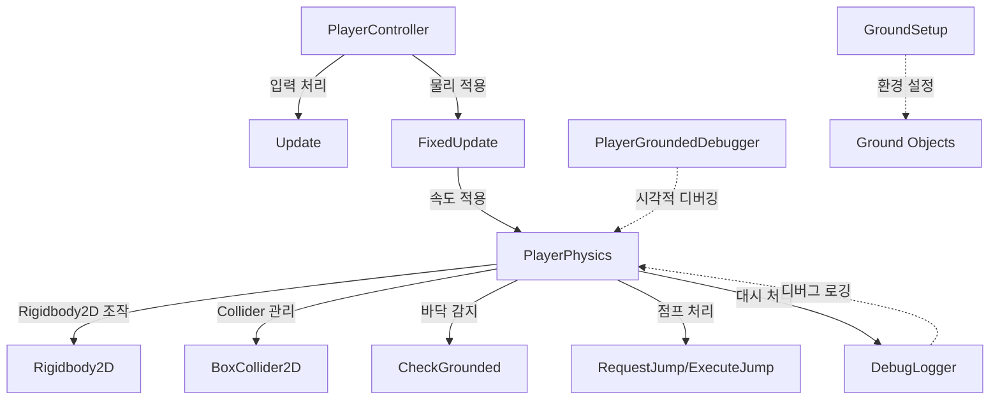

# 플레이어 이동 시스템 설계

2D 플랫포머 게임의 플레이어 이동 시스템 설계 원칙과 아키텍처를 정의합니다.

## 개요

이 문서는 2D 플랫포머 게임의 플레이어 이동 시스템에 대한 설계 원칙과 아키텍처를 설명합니다. 나인솔즈(Nine Sols) 스타일의 정밀하고 즉각적인 반응성을 목표로 합니다.

구현 세부사항은 [PlayerMovement-Implementation.md](./PlayerMovement-Implementation.md)를 참조하세요.

## 핵심 설계 원칙

### 1. 즉각적인 반응성

- **가속/감속 없음**: 입력에 즉시 반응하여 이동 속도가 바로 적용됩니다.
- **지연 없는 제어**: 키를 누르면 즉시 이동하고, 떼면 즉시 멈춥니다.
- **정밀한 조작**: 정밀한 제어가 가능합니다.

### 2. 입력 처리 분리

- **Update()**: 입력을 읽어서 변수에 저장합니다.
- **FixedUpdate()**: 저장된 입력 값을 사용하여 물리 계산을 수행합니다.

### 3. 물리 기반 이동

- **리지드바디 2D(`Rigidbody2D`) 사용**: Unity의 물리 시스템을 활용하여 중력, 충돌 등을 처리합니다.
- **Y축 속도 유지**: 수평 이동 시 Y축 속도(중력, 점프 등)는 그대로 유지됩니다.

### 4. 관심사 분리 (Separation of Concerns)

- **PlayerController**: 입력 처리 및 게임플레이 로직 담당
- **PlayerPhysics**: 물리 설정 및 속도 적용 담당
- 각 클래스의 책임을 명확히 분리하여 유지보수성 향상

## 아키텍처

### 클래스 구조

시스템은 다음과 같은 클래스들로 구성됩니다:

**핵심 클래스:**

1. **PlayerController**: 입력 처리 및 게임플레이 로직
2. **PlayerPhysics**: 물리 설정 및 속도 적용

**디버깅 도구:** 3. **DebugLogger**: NDJSON 형식 디버그 로깅 유틸리티 4. **PlayerGroundedDebugger**: 바닥 감지 상태(`IsGrounded`) 시각적 디버깅 (에디터 전용)

**환경 설정:** 5. **GroundSetup**: 바닥 오브젝트 자동 설정



### PlayerController 클래스

입력 처리 및 게임플레이 로직을 담당하는 컴포넌트입니다.

**주요 책임:**

- 수평 이동 입력 처리
- 점프 입력 처리 (점프 요청(`RequestJump`)/점프 키 해제(`ReleaseJump`))
- 대시 입력 처리 (대시 요청(`RequestDash`))
- Model 자식 오브젝트 방향 반전 (스프라이트 좌우 전환)

### PlayerPhysics 클래스

물리 관련 모든 로직을 담당하는 컴포넌트입니다.

**주요 책임:**

- 리지드바디 2D(`Rigidbody2D`) 및 박스 콜라이더 2D(`BoxCollider2D`) 초기화 및 설정
- 물리 속도 적용 (수평/수직/전체)
- 바닥 감지(`CheckGrounded`) (Raycast 기반)
- 점프 시스템 (Coyote Time, Jump Buffer, 가변 점프, 더블 점프)
- 대시 시스템 (쿨타임, 지상/공중 대시)

**공개 API:**

```csharp
public class PlayerPhysics : MonoBehaviour
{
    // 수평 속도만 적용 (Y축 속도 유지)
    public void ApplyHorizontalVelocity(float velocityX);

    // 수직 속도만 적용 (X축 속도 유지)
    public void ApplyVerticalVelocity(float velocityY);

    // 전체 속도 적용
    public void ApplyVelocity(Vector2 velocity);

    // 바닥 감지 상태
    public bool IsGrounded { get; }

    // 점프 중 상태
    public bool IsJumping { get; }

    // 남은 점프 횟수 (읽기 전용)
    public int RemainingJumps { get; }

    // 공중 점프 횟수 설정 (기능 해금 시스템과 연동)
    public void SetExtraJumps(int count);

    // 현재 공중 점프 횟수 (읽기 전용)
    public int ExtraJumps { get; }

    // 점프 요청(`RequestJump`) (Jump Buffer에 저장)
    public void RequestJump();

    // 점프 키 해제(`ReleaseJump`) (가변 점프 처리)
    public void ReleaseJump();

    // 바닥 감지(`CheckGrounded`) (내부에서 자동 호출)
    public void CheckGrounded();
}
```

## 점프 시스템 설계

점프 시스템은 `PlayerPhysics` 클래스에 구현되어 있습니다.

### 설계 의도

- **즉각적인 반응**: 점프 힘을 속도로 직접 적용하여 지연 없음
- **사용자 친화적**: Coyote Time과 Jump Buffer를 통해 플레이어가 실수로 점프를 놓치지 않도록 설계
- **가변 점프**: 점프 키를 빨리 떼면 낮게 점프하여 정밀한 제어 가능
- **더블 점프**: 공중에서 한 번 더 점프 가능하여 플랫포밍 유연성 향상

### 작동 원리

1. **점프 요청**: `PlayerController`에서 점프 요청(`RequestJump`) 호출 시 Jump Buffer에 저장
2. **바닥 감지**: `FixedUpdate()`에서 매 프레임 바닥 감지(`CheckGrounded`) 호출
3. **점프 실행**: Jump Buffer가 활성화되어 있고 점프 가능 상태일 때 점프 실행
   - 첫 번째 점프: 바닥 감지 상태(`IsGrounded`)가 true이거나 Coyote Time 내에 있을 때
   - 더블 점프: 공중에 있고 점프 카운터가 1 이하일 때
4. **가변 점프**: 점프 키를 떼면 점프 키 해제(`ReleaseJump`)가 호출되어 상승 속도 감소
5. **점프 카운터 관리**: 점프 실행 시 카운터 증가, 바닥 착지 시 리셋

### 구현된 기능

- **바닥 감지**: Raycast 기반으로 바닥 감지
- **Coyote Time**: 바닥 이탈 후 0.2초 동안 점프 허용 (기본값)
- **Jump Buffer**: 점프 키를 미리 눌러도 착지 시 자동으로 점프 실행 (0.2초 버퍼)
- **가변 점프**: 점프 키를 빨리 떼면 낮게 점프 (Jump Cut Multiplier: 0.5)
- **더블 점프**: 공중 점프 횟수에 따라 공중에서 추가 점프 가능 (기본값: 0, 기능 해금 시 1)

## 더블 점프 설계

더블 점프는 점프 시스템의 확장 기능으로, 플레이어가 공중에서 추가로 점프할 수 있게 합니다.

### 설계 원칙

- **점프 카운터 기반**: 현재 사용 가능한 점프 횟수를 추적
- **바닥 착지 시 리셋**: 바닥에 착지하면 점프 카운터가 최대값으로 리셋
- **즉각적인 반응**: 첫 번째 점프와 동일하게 즉각적으로 반응
- **Coyote Time 제한**: Coyote Time은 첫 번째 점프에만 적용
- **동적 확장 가능**: 공중 점프 횟수를 런타임에 변경 가능하여 기능 해금 시스템과 연동

### 상태 관리

- **기본 점프**: 항상 1회 (바닥에서의 점프)
- **공중 점프 횟수**: 0부터 시작 (기본값: 0, 기능 해금 시 증가)
  - 0: 더블 점프 불가 (기본 상태)
  - 1: 더블 점프 가능
  - 2 이상: 트리플 점프 이상 가능 (향후 확장)
- **최대 점프 횟수**: 기본 점프(1) + 공중 점프 횟수
- **점프 카운터**: 현재 사용 가능한 점프 횟수
  - 바닥에 착지 시 최대값으로 리셋
  - 점프 실행 시 1 감소
  - 0이 되면 더 이상 점프 불가

### 점프 실행 조건

1. **첫 번째 점프**: 바닥 감지 상태(`IsGrounded`)가 true이거나 Coyote Time 내에 있고, 점프 카운터가 0보다 클 때
2. **공중 점프**: 공중에 있고 점프 카운터가 0보다 클 때 (Coyote Time 미적용)
   - 공중 점프 횟수가 0이면 실행 불가
   - 공중 점프 횟수가 1 이상이면 실행 가능

### 기능 해금 시스템 연동

- **초기 상태**: 공중 점프 횟수 = 0 (더블 점프 불가)
- **기능 해금 후**: 공중 점프 횟수 = 1 (더블 점프 가능)
- **런타임 변경**: `SetExtraJumps(int count)` 메서드를 통해 공중 점프 횟수 동적 변경 가능
- **확장성**: 향후 트리플 점프, 쿼드러플 점프 등으로 확장 가능

## 대시 시스템 설계

대시 시스템은 나인솔즈의 기본 대시 설계 철학을 참고하여, 의도적으로 제한된 성능으로 구현됩니다.

### 설계 의도

- **제한된 회피**: 대시를 약하게 만들어 무지성 회피를 억제하고, 플레이어가 패턴을 학습하도록 유도합니다.
- **보조 이동 기술**: 생존용 만능 회피가 아니라, 전투와 플랫포밍을 보조하는 이동 기술로 설계됩니다.
- **플레이 스타일 제한**: "점프+대시로 도망다니는 플레이"를 의도적으로 억제하여 전략적인 플레이를 유도합니다.

### 설계 원칙

- **지상 한정 (초반)**: 초반에는 지상에서만 사용 가능하며, 공중 대시는 후반에 해금됩니다.
- **쿨타임 시스템**: 비교적 긴 쿨타임으로 무지성 회피를 억제합니다.
- **짧은 거리**: 제한된 이동 거리로 전략적인 사용을 유도합니다.
- **즉각적인 반응**: 입력에 즉시 반응하여 정밀한 제어가 가능합니다.

### 작동 원리

1. **대시 요청**: `PlayerController`에서 대시 입력 시 대시 요청(`RequestDash`) 호출
2. **쿨타임 확인**: 대시 쿨타임이 지났는지 확인
3. **사용 조건 확인**: 지상 대시인 경우 바닥 감지 상태(`IsGrounded`) 확인
4. **대시 실행**: 조건을 만족하면 대시 속도 적용
5. **쿨타임 시작**: 대시 사용 후 쿨타임 타이머 시작

### 구현 고려사항

**기본 대시:**

- **지상 한정**: 초반에는 지상에서만 사용 가능 (기본값)
- **쿨타임**: 비교적 긴 쿨타임 (기본값: 0.5~1.0초, 조정 가능)
- **대시 거리**: 제한된 이동 거리 (기본값: 캐릭터 크기의 1~2배, 조정 가능)
- **대시 속도**: 고정된 대시 속도 또는 거리 기반 시간 계산
- **대시 방향**: 입력 방향 또는 현재 이동 방향
- **Y축 속도 고정**: 대시 중에는 Y축 속도를 0으로 고정하여 위/아래 이동 없음

**공중 대시 (후반 해금):**

- 공중 대시는 기능 해금 시스템과 연동하여 후반에 개방
- 지상 대시와 동일한 쿨타임 공유 또는 별도 쿨타임
- 공중 대시 횟수 제한 가능 (기본값: 1회)

**피드백 설계:**

- 짧고 날카로운 애니메이션
- 분명한 시작·종료 프레임
- 대시 사용 시 시각적/청각적 피드백

### PlayerPhysics API 확장

대시 시스템을 위해 `PlayerPhysics` 클래스에 다음 API가 추가됩니다:

```csharp
public class PlayerPhysics : MonoBehaviour
{
    // 대시 요청(`RequestDash`) (쿨타임 및 조건 확인 후 실행)
    public void RequestDash(Vector2 direction);

    // 대시 중 상태
    public bool IsDashing { get; }

    // 대시 쿨타임 남은 시간 (읽기 전용)
    public float DashCooldownRemaining { get; }

    // 대시 사용 가능 여부
    public bool CanDash { get; }

    // 공중 대시 활성화 여부 설정 (기능 해금 시스템과 연동)
    public void SetAirDashEnabled(bool enabled);

    // 공중 대시 활성화 여부 (읽기 전용)
    public bool IsAirDashEnabled { get; }
}
```

### 기능 해금 시스템 연동

- **초기 상태**: 지상 대시만 가능, 공중 대시 비활성화
- **기능 해금 후**: 공중 대시 활성화
- **런타임 변경**: `SetAirDashEnabled(bool enabled)` 메서드를 통해 공중 대시 동적 활성화/비활성화 가능

## One-way Platform 시스템 설계

One-way Platform은 플레이어가 위에서 아래로 내려올 때만 통과할 수 있고, 아래에서 위로 올라갈 때는 막히는 플랫폼입니다.

### 설계 의도

- **플랫포밍 다양성**: 플레이어가 위에서 아래로 내려와야 하는 퍼즐과 플랫포밍 요소 추가
- **직관적인 동작**: 위에서 아래로는 자연스럽게 통과하고, 아래에서 위로는 막히는 직관적인 동작
- **아래 점프와 연동**: 아래 점프 기능과 함께 사용하여 플랫폼을 통과할 수 있음

### 작동 원리

1. **PlatformEffector2D 사용**: Unity의 PlatformEffector2D 컴포넌트를 사용하여 One-way platform 구현
2. **위에서 아래로만 통과**: 플레이어가 위에서 아래로 내려올 때만 통과 가능
3. **아래 점프 연동**: 아래 점프 시 One-way platform과의 충돌을 일시적으로 비활성화하여 통과 가능

### 구현된 기능

- **OneWayPlatform 컴포넌트**: One-way platform 자동 설정
- **아래 점프 통과**: 아래 점프 시 One-way platform 통과 가능
- **자동 설정**: 레이어, 콜라이더, PlatformEffector2D 자동 설정

## 아래 점프 시스템 설계

아래 점프는 플레이어가 아래 방향 키를 눌렀을 때 아래로 빠르게 낙하하거나 One-way platform을 통과할 수 있게 하는 기능입니다.

### 설계 의도

- **One-way platform 통과**: 아래 점프로 One-way platform을 통과할 수 있음
- **빠른 낙하**: 아래 방향 키를 눌러 빠르게 낙하 가능
- **직관적인 조작**: 아래 방향 키 입력으로 직관적으로 사용 가능

### 작동 원리

1. **아래 점프 요청**: `PlayerController`에서 아래 방향 키 입력 시 아래 점프 요청(`RequestDownJump`) 호출
2. **아래로 힘 적용**: 아래 방향으로 점프 힘을 적용하여 빠르게 낙하
3. **One-way platform 통과**: 아래 점프 시 플레이어 아래에 있는 One-way platform과의 충돌을 일시적으로 비활성화

### 구현된 기능

- **아래 방향 입력 감지**: S키 또는 아래 화살표 키 입력 감지
- **아래 점프 힘**: 아래 방향으로 빠르게 낙하하는 힘 적용
- **One-way platform 통과**: 아래 점프 시 One-way platform 통과 가능
- **충돌 무시 시간**: One-way platform 충돌 무시 시간 설정 가능

### PlayerPhysics API 확장

아래 점프 시스템을 위해 `PlayerPhysics` 클래스에 다음 API가 추가됩니다:

```csharp
public class PlayerPhysics : MonoBehaviour
{
    // 아래 점프 요청(`RequestDownJump`) (One-way platform 통과 및 아래로 점프)
    public void RequestDownJump();
}
```

## 향후 확장 가능한 기능

### 벽 점프

- 벽에 닿았을 때 점프 가능
- 벽 감지 시스템 추가 필요

### 공중 대시

- 공중에서 단거리 순간 이동
- 쿨타임 또는 스태미나 제한

### 대시 공격

- 대시 중 공격 시 특수 공격 모션
- 대시 공격 피해량 증가

## 참고 게임

- **나인솔즈 (Nine Sols)**: 정밀한 조작감과 즉각적인 반응성
- **할로우 나이트 (Hollow Knight)**: 정밀한 플랫포밍
