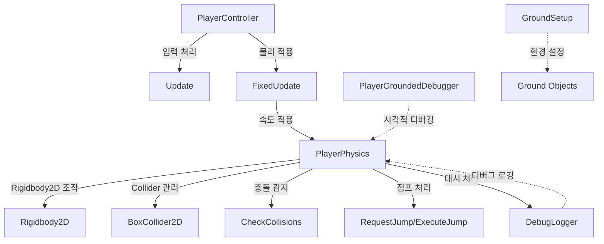

# 플레이어 이동 시스템 설계

2D 플랫포머 게임의 플레이어 이동 시스템 설계 원칙과 아키텍처를 정의합니다.

## 개요

이 문서는 2D 플랫포머 게임의 플레이어 이동 시스템에 대한 설계 원칙과 아키텍처를 설명합니다. 나인솔즈(Nine Sols) 스타일의 정밀하고 즉각적인 반응성을 목표로 합니다.

구현 세부사항은 [PlayerMovement-Implementation.md](./PlayerMovement-Implementation.md)를 참조하세요.

## 핵심 설계 원칙

### 1. 즉각적인 반응성

- **가속/감속 없음**: 입력에 즉시 반응하여 이동 속도가 바로 적용됩니다.
- **지연 없는 제어**: 키를 누르면 즉시 이동하고, 떼면 즉시 멈춥니다.
- **정밀한 조작**: 정밀한 제어가 가능합니다.

### 2. 입력 처리 분리

- **Update()**: 입력을 읽어서 변수에 저장합니다.
- **FixedUpdate()**: 저장된 입력 값을 사용하여 물리 계산을 수행합니다.

### 3. 물리 기반 이동

- **리지드바디 2D(`Rigidbody2D`) 사용**: Unity의 물리 시스템을 활용하여 중력, 충돌 등을 처리합니다.
- **Y축 속도 유지**: 수평 이동 시 Y축 속도(중력, 점프 등)는 그대로 유지됩니다.

### 4. 관심사 분리 (Separation of Concerns)

- **PlayerController**: 입력 처리 및 게임플레이 로직 담당
- **PlayerPhysics**: 물리 설정 및 속도 적용 담당
- 각 클래스의 책임을 명확히 분리하여 유지보수성 향상

## 아키텍처

### 클래스 구조

시스템은 다음과 같은 클래스들로 구성됩니다:

**핵심 클래스:**

1. **PlayerController**: 입력 처리 및 게임플레이 로직
2. **PlayerPhysics**: 물리 설정 및 속도 적용

**디버깅 도구:** 3. **DebugLogger**: NDJSON 형식 디버그 로깅 유틸리티 4. **PlayerGroundedDebugger**: 바닥 감지 상태(`IsGrounded`) 시각적 디버깅 (에디터 전용)

**환경 설정:** 5. **GroundSetup**: 바닥 오브젝트 자동 설정



### PlayerController 클래스

입력 처리 및 게임플레이 로직을 담당하는 컴포넌트입니다.

**주요 책임:**

- 수평 이동 입력 처리
- 점프 입력 처리 (점프 요청(`RequestJump`)/점프 키 해제(`ReleaseJump`))
- 대시 입력 처리 (대시 요청(`RequestDash`))
- Model 자식 오브젝트 방향 반전 (스프라이트 좌우 전환)

### PlayerPhysics 클래스

물리 관련 모든 로직을 담당하는 컴포넌트입니다.

**구조**: Partial 클래스로 기능별로 분리

- `PlayerPhysics.cs`: 메인 클래스, 기본 설정 및 공개 API
- `PlayerPhysics.Collision.cs`: 충돌 감지 시스템
- `PlayerPhysics.Jump.cs`: 점프 시스템
- `PlayerPhysics.Dash.cs`: 대시 시스템
- `PlayerPhysics.DownJump.cs`: 아래 점프 시스템

**주요 책임:**

- 리지드바디 2D(`Rigidbody2D`) 및 박스 콜라이더 2D(`BoxCollider2D`) 초기화 및 설정
- 물리 속도 적용 (수평/수직/전체)
- 충돌 감지 시스템 (다중 Raycast 기반 정밀 충돌 감지)
- 점프 시스템 (Coyote Time, Jump Buffer, 가변 점프, 더블 점프)
- 대시 시스템 (쿨타임, 지상/공중 대시)

**공개 API:**

```csharp
public partial class PlayerPhysics : MonoBehaviour
{
    // 속도 적용
    public void ApplyHorizontalVelocity(float velocityX);
    public void ApplyVerticalVelocity(float velocityY);
    public void ApplyVelocity(Vector2 velocity);

    // 물리 상태
    public bool IsGrounded { get; protected set; }
    public bool IsJumping { get; protected set; }
    public bool IsDashing { get; protected set; }
    public bool IsOnOneWayPlatform { get; protected set; }

    // 충돌 감지 상태
    public bool IsLeftCollision { get; protected set; }
    public bool IsRightCollision { get; protected set; }
    public bool IsCeiling { get; protected set; }
    public bool IsCollideX { get; protected set; }
    public bool IsCollideY { get; protected set; }

    // 점프 시스템
    public int RemainingJumps { get; protected set; }
    public int ExtraJumps { get; protected set; }
    public void RequestJump(); // 점프 요청 (Jump Buffer에 저장)
    public void ExecuteJumpIfPossible(); // 점프 실행 조건 체크 및 실행
    public void ExecuteJump(); // 점프 실행 (상태 머신에서 직접 호출)
    public void ReleaseJump(); // 점프 키 해제 (가변 점프)
    public void ResetJumpCounterOnLanding(); // 착지 시 점프 카운터 리셋
    public void SetExtraJumps(int count); // 공중 점프 횟수 설정

    // 대시 시스템
    public bool CanDash { get; }
    public bool IsAirDashEnabled { get; protected set; }
    public float DashCooldownRemaining { get; protected set; }
    public void RequestDash(Vector2 direction); // 대시 요청
    public void SetAirDashEnabled(bool enabled); // 공중 대시 활성화/비활성화

    // 아래 점프 시스템
    public void RequestDownJump(); // 아래 점프 요청

    // 물리 업데이트
    public void PhysisUpdate(); // FixedUpdate에서 호출

    // 충돌 감지
    public void CheckCollisions(); // PhysisUpdate 내부에서 호출

    // Rigidbody2D 속도
    public Vector2 RigidbodyVelocity { get; }
}
```

## 점프 시스템 설계

점프 시스템은 `PlayerPhysics` 클래스에 구현되어 있습니다.

### 설계 의도

- **즉각적인 반응**: 점프 힘을 속도로 직접 적용하여 지연 없음
- **사용자 친화적**: Coyote Time과 Jump Buffer를 통해 플레이어가 실수로 점프를 놓치지 않도록 설계
- **가변 점프**: 점프 키를 빨리 떼면 낮게 점프하여 정밀한 제어 가능
- **더블 점프**: 공중에서 한 번 더 점프 가능하여 플랫포밍 유연성 향상

### 작동 원리

1. **점프 요청**: `PlayerController`에서 점프 요청(`RequestJump`) 호출 시 Jump Buffer에 저장
2. **충돌 감지**: `FixedUpdate()`에서 매 프레임 충돌 감지(`CheckCollisions`) 호출하여 지면 상태 확인
3. **점프 실행**: Jump Buffer가 활성화되어 있고 점프 가능 상태일 때 점프 실행
   - 첫 번째 점프: 바닥 감지 상태(`IsGrounded`)가 true이거나 Coyote Time 내에 있을 때
   - 더블 점프: 공중에 있고 점프 카운터가 1 이하일 때
4. **가변 점프**: 점프 키를 떼면 점프 키 해제(`ReleaseJump`)가 호출되어 상승 속도 감소
5. **점프 카운터 관리**: 점프 실행 시 카운터 증가, 바닥 착지 시 리셋

### 구현된 기능

- **바닥 감지**: Raycast 기반으로 바닥 감지
- **Coyote Time**: 바닥 이탈 후 0.2초 동안 점프 허용 (기본값)
- **Jump Buffer**: 점프 키를 미리 눌러도 착지 시 자동으로 점프 실행 (0.2초 버퍼)
- **가변 점프**: 점프 키를 빨리 떼면 낮게 점프 (Jump Cut Multiplier: 0.5)
- **더블 점프**: 공중 점프 횟수에 따라 공중에서 추가 점프 가능 (기본값: 0, 기능 해금 시 1)

## 더블 점프 설계

더블 점프는 점프 시스템의 확장 기능으로, 플레이어가 공중에서 추가로 점프할 수 있게 합니다.

### 설계 원칙

- **점프 카운터 기반**: 현재 사용 가능한 점프 횟수를 추적
- **바닥 착지 시 리셋**: 바닥에 착지하면 점프 카운터가 최대값으로 리셋
- **즉각적인 반응**: 첫 번째 점프와 동일하게 즉각적으로 반응
- **Coyote Time 제한**: Coyote Time은 첫 번째 점프에만 적용
- **동적 확장 가능**: 공중 점프 횟수를 런타임에 변경 가능하여 기능 해금 시스템과 연동

### 상태 관리

- **기본 점프**: 항상 1회 (바닥에서의 점프)
- **공중 점프 횟수**: 0부터 시작 (기본값: 0, 기능 해금 시 증가)
  - 0: 더블 점프 불가 (기본 상태)
  - 1: 더블 점프 가능
  - 2 이상: 트리플 점프 이상 가능 (향후 확장)
- **최대 점프 횟수**: 기본 점프(1) + 공중 점프 횟수
- **점프 카운터**: 현재 사용 가능한 점프 횟수
  - 바닥에 착지 시 최대값으로 리셋
  - 점프 실행 시 1 감소
  - 0이 되면 더 이상 점프 불가

### 점프 실행 조건

1. **첫 번째 점프**: 바닥 감지 상태(`IsGrounded`)가 true이거나 Coyote Time 내에 있고, 점프 카운터가 0보다 클 때
2. **공중 점프**: 공중에 있고 점프 카운터가 0보다 클 때 (Coyote Time 미적용)
   - 공중 점프 횟수가 0이면 실행 불가
   - 공중 점프 횟수가 1 이상이면 실행 가능

### 기능 해금 시스템 연동

- **초기 상태**: 공중 점프 횟수 = 0 (더블 점프 불가)
- **기능 해금 후**: 공중 점프 횟수 = 1 (더블 점프 가능)
- **런타임 변경**: `SetExtraJumps(int count)` 메서드를 통해 공중 점프 횟수 동적 변경 가능
- **확장성**: 향후 트리플 점프, 쿼드러플 점프 등으로 확장 가능

## 대시 시스템 설계

대시 시스템은 나인솔즈의 기본 대시 설계 철학을 참고하여, 의도적으로 제한된 성능으로 구현됩니다.

### 설계 의도

- **제한된 회피**: 대시를 약하게 만들어 무지성 회피를 억제하고, 플레이어가 패턴을 학습하도록 유도합니다.
- **보조 이동 기술**: 생존용 만능 회피가 아니라, 전투와 플랫포밍을 보조하는 이동 기술로 설계됩니다.
- **플레이 스타일 제한**: "점프+대시로 도망다니는 플레이"를 의도적으로 억제하여 전략적인 플레이를 유도합니다.

### 설계 원칙

- **지상 한정 (초반)**: 초반에는 지상에서만 사용 가능하며, 공중 대시는 후반에 해금됩니다.
- **쿨타임 시스템**: 비교적 긴 쿨타임으로 무지성 회피를 억제합니다.
- **짧은 거리**: 제한된 이동 거리로 전략적인 사용을 유도합니다.
- **즉각적인 반응**: 입력에 즉시 반응하여 정밀한 제어가 가능합니다.

### 작동 원리

1. **대시 요청**: `PlayerController`에서 대시 입력 시 대시 요청(`RequestDash`) 호출
2. **쿨타임 확인**: 대시 쿨타임이 지났는지 확인
3. **사용 조건 확인**: 지상 대시인 경우 바닥 감지 상태(`IsGrounded`) 확인
4. **대시 실행**: 조건을 만족하면 대시 속도 적용
5. **쿨타임 시작**: 대시 사용 후 쿨타임 타이머 시작

### 구현 고려사항

**기본 대시:**

- **지상 한정**: 초반에는 지상에서만 사용 가능 (기본값)
- **쿨타임**: 비교적 긴 쿨타임 (기본값: 0.5~1.0초, 조정 가능)
- **대시 거리**: 제한된 이동 거리 (기본값: 캐릭터 크기의 1~2배, 조정 가능)
- **대시 속도**: 고정된 대시 속도 또는 거리 기반 시간 계산
- **대시 방향**: 입력 방향 또는 현재 이동 방향
- **Y축 속도 고정**: 대시 중에는 Y축 속도를 0으로 고정하여 위/아래 이동 없음

**공중 대시 (후반 해금):**

- 공중 대시는 기능 해금 시스템과 연동하여 후반에 개방
- 지상 대시와 동일한 쿨타임 공유 또는 별도 쿨타임
- 공중 대시 횟수 제한 가능 (기본값: 1회)

**피드백 설계:**

- 짧고 날카로운 애니메이션
- 분명한 시작·종료 프레임
- 대시 사용 시 시각적/청각적 피드백

### PlayerPhysics API 확장

대시 시스템을 위해 `PlayerPhysics` 클래스에 다음 API가 추가됩니다:

```csharp
public class PlayerPhysics : MonoBehaviour
{
    // 대시 요청(`RequestDash`) (쿨타임 및 조건 확인 후 실행)
    public void RequestDash(Vector2 direction);

    // 대시 중 상태
    public bool IsDashing { get; }

    // 대시 쿨타임 남은 시간 (읽기 전용)
    public float DashCooldownRemaining { get; }

    // 대시 사용 가능 여부
    public bool CanDash { get; }

    // 공중 대시 활성화 여부 설정 (기능 해금 시스템과 연동)
    public void SetAirDashEnabled(bool enabled);

    // 공중 대시 활성화 여부 (읽기 전용)
    public bool IsAirDashEnabled { get; }
}
```

### 기능 해금 시스템 연동

- **초기 상태**: 지상 대시만 가능, 공중 대시 비활성화
- **기능 해금 후**: 공중 대시 활성화
- **런타임 변경**: `SetAirDashEnabled(bool enabled)` 메서드를 통해 공중 대시 동적 활성화/비활성화 가능

## 충돌 감지 시스템 설계

충돌 감지 시스템은 다중 Raycast를 사용하여 정밀한 충돌 정보를 제공합니다.

### 설계 의도

- **정밀한 충돌 감지**: 다중 Raycast를 사용하여 엣지 케이스와 좁은 플랫폼도 정확히 감지
- **4방향 충돌 감지**: 지면, 천장, 좌우 벽 충돌을 모두 감지하여 다양한 게임플레이 기능 지원
- **확장성**: 벽 점프, 벽 슬라이딩 등 향후 기능 구현을 위한 기반 제공
- **기존 시스템과 통합**: 기존 바닥 감지 시스템과 호환되며 점진적으로 개선 가능

### 설계 원칙

- **다중 Raycast**: 수평/수직 각각 여러 개의 Raycast를 사용하여 정밀도 향상
- **정보 제공 중심**: Unity 물리 시스템과 함께 작동하며 충돌 정보만 제공
- **성능 최적화**: Raycast 개수를 Inspector에서 조정 가능하여 성능과 정밀도 균형 유지
- **기존 호환성**: 기존 `IsGrounded` 프로퍼티는 유지하여 기존 코드와 호환

### 작동 원리

1. **Raycast 원점 계산**: 
   - 양끝 레이캐스트: Unity의 `Physics2D.defaultContactOffset`을 고려하여 콜라이더 바깥쪽으로 확장
   - 가운데 레이캐스트: 콜라이더 경계에서 `skinWidth`만큼 안쪽으로 이동한 위치에 설정
   - 지면 감지 시: 레이캐스트 원점을 `skinWidth`만큼 위로 이동하여 안정성 확보
2. **수평 충돌 감지**: 이동 방향에 따라 좌우에서 여러 개의 Raycast를 발사하여 벽 충돌 감지
3. **수직 충돌 감지**: 위아래로 여러 개의 Raycast를 발사하여 지면과 천장 충돌 감지
4. **충돌 정보 저장**: 감지된 충돌 정보를 `PlayerCollisionInfo` 구조체에 저장
5. **통합 처리**: 다중 Raycast 시스템이 `IsGrounded` 상태를 업데이트

### 구현된 기능

- **다중 Raycast 시스템**: 수평/수직 각각 2~8개의 Raycast 사용 (기본값: 4개)
- **지면 감지**: 기존 단일 Raycast 방식보다 정확한 지면 감지
- **벽 충돌 감지**: 좌우 벽 충돌을 감지하여 벽 점프 등 향후 기능 지원
- **천장 감지**: 천장 충돌을 감지하여 머리 박기 방지 등에 활용 가능
- **One-way Platform 지원**: One-way platform과의 충돌을 올바르게 처리
- **디버그 시각화**: Scene 뷰에서 Raycast를 시각적으로 확인 가능

### Raycast 설정

- **Skin Width**: 가운데 Raycast 원점을 콜라이더 경계에서 안쪽으로 이동시킬 거리 (기본값: 0.03f)
- **Default Contact Offset**: Unity 물리 엔진의 `Physics2D.defaultContactOffset` 값을 사용하여 양끝 레이캐스트 위치 조정 (프로젝트 설정에서 확인 가능, 기본값: 0.01f)
- **수평 Raycast 개수**: 좌우 벽 감지에 사용할 Raycast 개수 (기본값: 4개, 범위: 1개 이상)
- **수직 Raycast 개수**: 지면/천장 감지에 사용할 Raycast 개수 (기본값: 4개, 범위: 1개 이상)
- **Raycast 간격**: 콜라이더 크기와 `skinWidth`를 고려하여 자동으로 계산

### PlayerPhysics API 확장

충돌 감지 시스템을 위해 `PlayerPhysics` 클래스에 다음 API가 추가됩니다:

```csharp
public class PlayerPhysics : MonoBehaviour
{
    // 충돌 감지 상태 프로퍼티
    public bool IsLeftCollision { get; }      // 왼쪽 벽 충돌
    public bool IsRightCollision { get; }     // 오른쪽 벽 충돌
    public bool IsCeiling { get; }            // 천장 충돌
    public bool IsCollideX { get; }           // 수평 충돌 (좌우 중 하나)
    public bool IsCollideY { get; }           // 수직 충돌 (위아래 중 하나)
    
    // 충돌 감지 메서드 (내부에서 자동 호출)
    public void CheckCollisions();
}
```

### 기존 시스템과의 통합

- **통합된 지면 감지**: 다중 Raycast 시스템이 `IsGrounded` 프로퍼티를 직접 업데이트
- **One-way Platform 처리**: One-way platform과의 충돌을 올바르게 처리
  - **수직 충돌**: 속도 기반 판단으로 위에서 아래로만 통과 허용
  - **수평 충돌**: One-way platform의 좌우 충돌은 항상 무시
  - **아래 점프 연동**: 아래 점프 시 타이머 기반 무시와 함께 작동
- **Coyote Time 지원**: Coyote Time 시스템과 함께 작동
- **Unity 물리 엔진과의 일치**: `Physics2D.defaultContactOffset`을 사용하여 Unity 물리 엔진이 계산하는 실제 충돌 영역과 일치

### 향후 확장 가능한 기능

충돌 감지 시스템을 기반으로 다음 기능들을 구현할 수 있습니다:

- **벽 점프**: `IsLeftCollision` 또는 `IsRightCollision`을 활용하여 벽에 닿았을 때 점프 가능
- **벽 슬라이딩**: 벽에 닿았을 때 미끄러지는 동작
- **천장 밀기**: 천장에 닿았을 때 특수 동작
- **경사면 처리**: 향후 경사면 오르기/내려가기 기능 구현 가능

## One-way Platform 시스템 설계

One-way Platform은 플레이어가 위에서 아래로 내려올 때만 통과할 수 있고, 아래에서 위로 올라갈 때는 막히는 플랫폼입니다.

### 설계 의도

- **플랫포밍 다양성**: 플레이어가 위에서 아래로 내려와야 하는 퍼즐과 플랫포밍 요소 추가
- **직관적인 동작**: 위에서 아래로는 자연스럽게 통과하고, 아래에서 위로는 막히는 직관적인 동작
- **아래 점프와 연동**: 아래 점프 기능과 함께 사용하여 플랫폼을 통과할 수 있음
- **유연한 확장성**: 컴포넌트 기반 설계로 다양한 플랫폼 타입 추가 가능
- **정확한 충돌 처리**: 속도 기반 판단으로 일시적인 속도 변화에도 안정적으로 동작

### 작동 원리

#### 1. 플랫폼 식별 방식

- **컴포넌트 기반**: `OneWayPlatform` 컴포넌트를 가진 오브젝트를 One-way platform으로 식별
  - 태그 기반이 아닌 컴포넌트 기반으로 설계하여 유연성과 확장성 확보
  - 각 플랫폼에 개별 설정이 가능하며, 향후 다양한 플랫폼 타입 추가 용이

#### 2. 충돌 감지 및 통과 판단

**수직 충돌 감지 (지면/천장):**

1. **속도 기반 판단**: 플레이어의 Y축 속도(`currentVelocityY`)를 기준으로 통과 여부 결정
   - `currentVelocityY < 0f`: 아래로 이동 중 → 통과 허용
   - `currentVelocityY >= 0f`: 위로 이동 중 또는 정지 → 착지 처리
   - 속도 기반 판단으로 이동 방향을 정확히 파악하여 의도치 않은 통과 방지

2. **천장 충돌 처리**: 위로 이동 중 One-way platform과 충돌 시 항상 통과
   - 플레이어가 아래에서 위로 올라갈 때는 막히지 않도록 처리

3. **착지 판단**: One-way platform 위에 착지할 때는 실제 착지로 간주
   - `isActuallyGrounded = !isOneWayPlatform || currentVelocityY >= 0f`
   - 통과 중이 아닐 때만 착지 상태로 설정하여 안정적인 플랫포밍 제공

**수평 충돌 감지 (좌우 벽):**

- One-way platform은 수평 충돌에서 항상 무시
  - One-way platform은 위에서 아래로만 통과 가능하므로 좌우 충돌은 발생하지 않아야 함
  - 플레이어가 플랫폼 옆면에 닿아도 충돌로 처리하지 않음

#### 3. 아래 점프 통과 메커니즘

아래 점프 시 One-way platform을 통과하기 위한 이중 보호 메커니즘:

1. **타이머 기반 무시**: `_isIgnoringPlatforms` 플래그와 타이머로 일정 시간 동안 플랫폼 무시
   - 기본 무시 시간: 0.3초 (설정 가능)
   - FixedUpdate에서 타이머 감소 및 자동 해제

2. **플랫폼 콜라이더 비활성화**: 플레이어 아래에 있는 One-way platform의 콜라이더를 일시적으로 비활성화
   - `OneWayPlatform.DisableCollisionTemporarily()` 메서드 호출
   - Raycast로 플레이어 아래의 모든 One-way platform을 찾아 일괄 처리
   - 이중 보호로 확실한 통과 보장

3. **속도 제한**: 아래 점프 힘을 제한하여 너무 빠른 낙하 방지
   - `_downJumpForce`로 최대 낙하 속도 제한

### 구현 세부사항

#### OneWayPlatform 컴포넌트

- **자동 설정**: Awake에서 레이어, 콜라이더, Rigidbody2D, PlatformEffector2D 자동 설정
- **PlatformEffector2D 설정**: 
  - `useOneWay = true`: One-way platform 활성화
  - `surfaceArc = 180f`: 위쪽 180도만 통과 가능
- **충돌 비활성화 메서드**: `DisableCollisionTemporarily(float duration)`로 일시적 충돌 비활성화

#### PlayerPhysics 충돌 감지 로직

**수직 충돌 검사 (`CheckVerticalCollisions`):**

```csharp
// One-way platform 처리
OneWayPlatform oneWayPlatform = hit.collider.GetComponent<OneWayPlatform>();
bool isOneWayPlatform = oneWayPlatform != null;
float currentVelocityY = _rb.linearVelocity.y;

if (isOneWayPlatform)
{
    // 아래로 내려가는 중이면 통과
    if (currentVelocityY < 0f)
    {
        continue; // 통과
    }
}

// 착지 판단: One-way platform을 통과하는 중이 아니면 착지
bool isActuallyGrounded = !isOneWayPlatform || currentVelocityY >= 0f;
```

**수평 충돌 검사 (`CheckHorizontalCollisions`):**

```csharp
// One-way platform은 수평 충돌에서 무시
OneWayPlatform oneWayPlatform = hit.collider.GetComponent<OneWayPlatform>();
if (oneWayPlatform != null)
{
    continue; // 무시
}
```

**아래 점프 처리 (`RequestDownJump`):**

```csharp
// 타이머 기반 무시 시작
_isIgnoringPlatforms = true;
_platformIgnoreTimer = _downJumpPlatformIgnoreTime;

// 플랫폼 콜라이더 비활성화
IgnoreOneWayPlatformsBelow();
```

### 설계 결정 사항

#### 컴포넌트 기반 vs 태그 기반

- **선택**: 컴포넌트 기반 (`OneWayPlatform` 컴포넌트)
- **이유**: 
  - 각 플랫폼에 개별 설정 가능 (향후 확장성)
  - Unity Inspector에서 직관적으로 확인 가능
  - 태그 관리 부담 없음

#### 속도 기반 vs 이동 방향 기반

- **선택**: 속도 기반 판단 (`currentVelocityY < 0f`)
- **이유**:
  - Rigidbody2D의 실제 속도를 직접 확인하여 정확함
  - 이동량 계산 없이 즉시 판단 가능
  - 일시적인 속도 변화에도 안정적으로 동작

#### 이중 보호 메커니즘

- **선택**: 타이머 기반 무시 + 플랫폼 콜라이더 비활성화
- **이유**:
  - 타이머만으로는 타이밍 이슈 발생 가능
  - 콜라이더 비활성화만으로는 타이머 관리 복잡
  - 두 방식을 결합하여 확실한 통과 보장

### 구현된 기능

- **OneWayPlatform 컴포넌트**: One-way platform 자동 설정 및 관리
- **속도 기반 통과 판단**: Y축 속도를 기준으로 정확한 통과 여부 결정
- **수평 충돌 무시**: One-way platform의 좌우 충돌 무시
- **아래 점프 통과**: 이중 보호 메커니즘으로 확실한 통과 보장
- **자동 설정**: 레이어, 콜라이더, PlatformEffector2D 자동 설정
- **타이머 기반 무시**: 아래 점프 후 일정 시간 동안 플랫폼 무시

## 아래 점프 시스템 설계

아래 점프는 플레이어가 아래 방향 키와 점프 키를 동시에 눌렀을 때 아래로 빠르게 낙하하거나 One-way platform을 통과할 수 있게 하는 기능입니다.

### 설계 의도

- **One-way platform 통과**: 아래 점프로 One-way platform을 통과할 수 있음
- **빠른 낙하**: 아래 방향 키 + 점프 키를 동시에 눌러 빠르게 낙하 가능
- **직관적인 조작**: 아래 방향 키 + 점프 키 조합으로 직관적으로 사용 가능
- **일반 점프와 구분**: 일반 점프는 아래 방향 키가 눌려있지 않을 때만 작동하여 의도치 않은 동작 방지
- **지면 한정**: 지면에 닿아있을 때만 사용 가능하여 공중에서의 남용 방지
- **확실한 통과 보장**: 이중 보호 메커니즘으로 One-way platform 통과 실패 방지

### 작동 원리

#### 1. 입력 감지 및 조건 확인

1. **아래 점프 요청**: `PlayerController`에서 아래 방향 키와 점프 키를 동시에 눌렀을 때 아래 점프 요청(`RequestDownJump`) 호출
2. **지면 감지 확인**: 지면에 닿아있을 때만 아래 점프 실행 (공중에서는 무시)
   - `IsGrounded`가 `true`일 때만 실행
   - 공중에서의 남용 방지 및 의도치 않은 동작 방지
3. **일반 점프 예외 처리**: 일반 점프 입력 시 아래 방향 키가 눌려있으면 점프 요청을 무시
   - 아래 점프와 일반 점프의 명확한 구분

#### 2. 속도 적용

4. **아래로 힘 적용**: 아래 방향으로 점프 힘을 적용하여 빠르게 낙하
   - `_downJumpForce` 값으로 최대 낙하 속도 제한
   - 현재 속도가 이미 더 빠르면 유지 (`Mathf.Min(currentVelocityY, _downJumpForce)`)
   - 너무 빠른 낙하로 인한 버그 방지

#### 3. One-way Platform 통과 메커니즘

아래 점프 시 One-way platform을 확실히 통과하기 위한 이중 보호 메커니즘:

**방법 1: 타이머 기반 무시**

- `_isIgnoringPlatforms` 플래그를 `true`로 설정
- `_platformIgnoreTimer`를 `_downJumpPlatformIgnoreTime`(기본 0.3초)으로 설정
- `FixedUpdate`에서 매 프레임 타이머 감소
- 타이머가 0 이하가 되면 자동으로 플래그 해제

**방법 2: 플랫폼 콜라이더 비활성화**

- `IgnoreOneWayPlatformsBelow()` 메서드 호출
- 플레이어 콜라이더 하단에서 아래로 Raycast 발사
- 감지된 모든 One-way platform의 `DisableCollisionTemporarily()` 호출
- 각 플랫폼의 콜라이더를 일시적으로 비활성화
- 지정된 시간 후 자동으로 다시 활성화

**이중 보호의 이유:**

- 타이머만으로는 타이밍 이슈나 프레임 드롭 시 통과 실패 가능
- 콜라이더 비활성화만으로는 타이머 관리 복잡
- 두 방식을 결합하여 확실한 통과 보장

### 구현 세부사항

#### PlayerPhysics 구현

**아래 점프 요청 처리:**

```csharp
public void RequestDownJump()
{
    if (!_collisionInfo.below) return; // 지면에 닿아있을 때만
    
    // 속도 제한 적용
    float currentVelocityY = _rb.linearVelocity.y;
    float newVelocityY = Mathf.Min(currentVelocityY, _downJumpForce);
    _rb.linearVelocity = new Vector2(_rb.linearVelocity.x, newVelocityY);
    
    // 타이머 기반 무시 시작
    _isIgnoringPlatforms = true;
    _platformIgnoreTimer = _downJumpPlatformIgnoreTime;
    
    // 플랫폼 콜라이더 비활성화
    IgnoreOneWayPlatformsBelow();
}
```

**플랫폼 찾기 및 비활성화:**

```csharp
private void IgnoreOneWayPlatformsBelow()
{
    // 플레이어 하단에서 아래로 Raycast
    Vector2 rayOrigin = new Vector2(boxCenter.x, boxCenter.y - boxSize.y * 0.5f - 0.05f);
    RaycastHit2D[] hits = Physics2D.RaycastAll(rayOrigin, Vector2.down, 2f, _groundLayerMask);
    
    // 모든 One-way platform 찾아서 비활성화
    foreach (RaycastHit2D hit in hits)
    {
        OneWayPlatform oneWayPlatform = hit.collider.GetComponent<OneWayPlatform>();
        if (oneWayPlatform != null)
        {
            oneWayPlatform.DisableCollisionTemporarily(_downJumpPlatformIgnoreTime);
        }
    }
}
```

**타이머 관리:**

```csharp
private void FixedUpdate()
{
    // 타이머 감소
    if (_isIgnoringPlatforms)
    {
        _platformIgnoreTimer -= Time.fixedDeltaTime;
        if (_platformIgnoreTimer <= 0f)
        {
            _isIgnoringPlatforms = false;
        }
    }
}
```

#### OneWayPlatform 컴포넌트

**충돌 비활성화 메서드:**

```csharp
public void DisableCollisionTemporarily(float duration = 0.5f)
{
    _boxCollider.enabled = false;
    Invoke(nameof(EnableCollision), duration);
}
```

### 설계 결정 사항

#### 지면 한정 사용

- **선택**: 지면에 닿아있을 때만 아래 점프 사용 가능
- **이유**:
  - 공중에서의 남용 방지
  - 의도치 않은 낙하 방지
  - One-way platform 위에서만 사용하도록 제한

#### 이중 보호 메커니즘

- **선택**: 타이머 기반 무시 + 플랫폼 콜라이더 비활성화
- **이유**:
  - 단일 방식의 한계 보완
  - 확실한 통과 보장
  - 다양한 상황에서 안정적으로 동작

#### 속도 제한

- **선택**: `_downJumpForce`로 최대 낙하 속도 제한
- **이유**:
  - 너무 빠른 낙하로 인한 버그 방지
  - 게임플레이 밸런스 유지
  - 플레이어가 제어 가능한 범위 내에서 동작

### 구현된 기능

- **아래 방향 + 점프 키 조합 입력 감지**: S키 또는 아래 화살표 키와 Space 키를 동시에 눌렀을 때 감지
- **지면 한정**: 지면에 닿아있을 때만 아래 점프 사용 가능 (공중에서는 무시)
- **일반 점프 예외 처리**: 아래 방향 키가 눌려있을 때 일반 점프 입력 무시
- **아래 점프 힘**: 아래 방향으로 빠르게 낙하하는 힘 적용 (속도 제한 포함)
- **One-way platform 통과**: 이중 보호 메커니즘으로 확실한 통과 보장
  - 타이머 기반 무시: `_isIgnoringPlatforms` 플래그와 타이머
  - 플랫폼 콜라이더 비활성화: `DisableCollisionTemporarily()` 메서드
- **충돌 무시 시간**: One-way platform 충돌 무시 시간 설정 가능 (기본 0.3초)

### PlayerPhysics API 확장

아래 점프 시스템을 위해 `PlayerPhysics` 클래스에 다음 API가 추가됩니다:

```csharp
public class PlayerPhysics : MonoBehaviour
{
    // 아래 점프 요청(`RequestDownJump`) (One-way platform 통과 및 아래로 점프)
    public void RequestDownJump();
}
```

## 향후 확장 가능한 기능

### 벽 점프

- 벽에 닿았을 때 점프 가능
- 충돌 감지 시스템의 `IsLeftCollision`/`IsRightCollision` 활용
- 벽 점프 시 수직 속도 적용 및 벽에서 밀려나는 힘 추가

### 공중 대시

- 공중에서 단거리 순간 이동
- 쿨타임 또는 스태미나 제한

### 대시 공격

- 대시 중 공격 시 특수 공격 모션
- 대시 공격 피해량 증가

## 참고 게임

- **나인솔즈 (Nine Sols)**: 정밀한 조작감과 즉각적인 반응성
- **할로우 나이트 (Hollow Knight)**: 정밀한 플랫포밍
