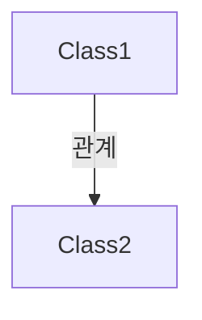

# Team Docs Style Guide

여러 프로젝트에서 공통으로 사용하는 문서 작성 규칙입니다.

## 파일 위치와 역할

이 문서는 프로젝트 루트의 `Documentation/` 폴더에 위치하며, 모든 문서 작성 시 참조해야 합니다.

**사용 방법:**

- 각 프로젝트의 `README.md`에서 이 문서를 참조하세요.
- 예: `문서 작성 규칙은 [TeamDocsStyleGuide.md](./Documentation/TeamDocsStyleGuide.md)를 참고하세요.`

## 1. 문서 기본 원칙

### 목적

이 문서는 팀 내 모든 문서를 같은 스타일로 작성하기 위한 규칙을 정의합니다.

### 공통 원칙

- **한 문서에는 하나의 주제만 다룹니다.**
- **설계 의도와 구현 디테일은 가급적 문서를 분리합니다.**
  - 시스템이 복잡하거나 독자가 다를 때 분리
  - 같은 문서 내에서 섹션으로 구분하는 것도 허용
  - **권장 방식**: 설계 문서(`-Design.md`)와 구현 문서(`-Implementation.md`)로 분리
    - 설계 문서: 설계 원칙, 아키텍처, 클래스 구조, 다이어그램
    - 구현 문서: 코드 예시, API 사용법, 설정 방법, 테스트 체크리스트
    - 예시: `PlayerMovement-Design.md`, `PlayerMovement-Implementation.md`
- **모든 문서는 실제 코드와 동기화되도록 유지합니다.**
  - 코드 변경 시 관련 문서도 함께 업데이트

### 언어 규칙

- 기본 언어: **한국어**
- 기술 용어는 처음 등장 시 한글+영문 병기 후 통일된 표기 사용
  - 예: `Rigidbody2D`, `BoxCollider2D`, `IsGrounded` 프로퍼티

## 2. 마크다운 스타일 가이드

### 헤딩 규칙

- 문서당 `#`(H1)는 한 번만 사용 (문서 제목)
- 섹션은 `##`(H2), `###`(H3) 사용
- 필요 시 `####`(H4)도 사용 가능하나, H3 하위에서만 사용
- 헤딩은 60자 이내, 내용이 눈에 들어오게 작성

### 문단과 텍스트

- 한 문단은 2–3문장 이내로 유지
- 너무 길어지면 목록으로 분리
- 중요 용어는 처음 등장 시 한글+영문 병기 후 통일된 표기 사용
  - 예: "바닥 감지(`CheckGrounded`) 메서드는..."

### 목록

- 순서가 중요하면 `1.` 사용
- 순서가 중요하지 않으면 `-` 사용
- 체크리스트는 GitHub Task List 형식(`- [ ]`) 사용
  - 예: `- [ ] 키 입력에 즉시 반응하는가?`

### 코드 블록

- 항상 언어 지정 (` ```csharp`, ` ```yaml` 등)
- 짧은 식별자/키워드는 인라인 코드(`` `IsGrounded` ``)로 표기
- 긴 코드는 블록으로 분리하고 주석 추가

**코드 블록 예시:**

````markdown
```csharp
public bool IsGrounded => _isGrounded;
```
````

**인라인 코드 예시:**

```markdown
`IsGrounded` 프로퍼티는 바닥 감지 상태를 반환합니다.
```

### 링크

- 레포 내부는 상대 경로 사용
  - 예: `[PlayerMovement.md](./PlayerMovement.md)`
- 외부는 https 링크 사용
- 긴 URL은 "링크 텍스트"를 써서 감춤
  - 예: `[Unity 공식 문서](https://docs.unity3d.com/...)`

### 다이어그램

- Mermaid 다이어그램 사용 가능
- 복잡한 다이어그램은 이미지로 대체 가능

## 3. 문서 타입별 템플릿

### 3.1 시스템 설계 문서

시스템 설계 문서는 게임의 주요 시스템(이동, 전투, 인벤토리 등)을 설명합니다.

**템플릿:**

````markdown
# 시스템 이름

이 문서가 다루는 시스템을 한 줄로 설명합니다.

## 개요

시스템의 목적과 핵심 기능을 간단히 설명합니다.

## 핵심 설계 원칙

### 1. 원칙 이름

- 설명 1
- 설명 2

### 2. 원칙 이름

- 설명 1
- 설명 2

## 구현 세부사항

### 주요 기능 1

- 세부 설명
- 파라미터 및 기본값

### 주요 기능 2

- 세부 설명

## 아키텍처

### 클래스 구조

시스템을 구성하는 주요 클래스들을 나열합니다.

**핵심 클래스:**

1. **ClassName1**: 역할 설명
2. **ClassName2**: 역할 설명


````

### ClassName1

주요 책임과 공개 API를 설명합니다.

**공개 API:**

```csharp
public class ClassName1 : MonoBehaviour
{
    public void Method1();
    public bool Property1 { get; }
}
```

**설정 가능한 필드:**

- `Field1`: 설명 (기본값: 값)
- `Field2`: 설명

## 코드 구조

### ClassName1

코드 예시와 설명

```csharp
public class ClassName1 : MonoBehaviour
{
    [SerializeField] private float _field1 = 5f;

    private void Update()
    {
        // 구현 내용
    }
}
```

## 테스트 체크리스트

### 기본 기능

- [ ] 테스트 케이스 1
- [ ] 테스트 케이스 2

### 고급 기능

- [ ] 테스트 케이스 3
- [ ] 테스트 케이스 4

## 주의사항

1. 주의사항 1
2. 주의사항 2

## 참고 게임

- **게임 이름**: 참고할 만한 특징

````

### 3.2 README

프로젝트 루트의 `README.md` 템플릿입니다.

**템플릿:**

```markdown
# 프로젝트 이름

프로젝트에 대한 한 줄 설명입니다.

## 개요

프로젝트의 목적과 주요 기능을 설명합니다.

## 시작하기

### 요구사항
- Unity 버전: 2021.3 LTS 이상
- 플랫폼: Windows, Mac, Linux

### 설치 방법
1. 레포지토리 클론
2. Unity Hub에서 프로젝트 열기
3. 씬 실행

## 프로젝트 구조

````

Assets/
├── Scripts/
│ ├── Runtime/
│ └── Editor/
├── Prefabs/
└── Scenes/

```

## 문서

- [문서 작성 규칙](./Documentation/TeamDocsStyleGuide.md)
- [시스템 설계 문서](./Documentation/)

## 라이선스

라이선스 정보
```

### 3.3 API/컴포넌트 스펙 문서

개별 스크립트나 컴포넌트의 상세 스펙을 설명합니다.

**템플릿:**

````markdown
# ClassName

클래스에 대한 한 줄 설명입니다.

## 개요

클래스의 목적과 역할을 설명합니다.

## 공개 API

### 메서드

#### MethodName

메서드 설명

**시그니처:**

```csharp
public void MethodName(float parameter);
```
````

**매개변수:**

- `parameter`: 설명

**반환값:**

- 설명

**예시:**

```csharp
component.MethodName(10f);
```

### 프로퍼티

#### PropertyName

프로퍼티 설명

**타입:** `bool`

**예시:**

```csharp
if (component.PropertyName)
{
    // ...
}
```

## 설정

Inspector에서 설정 가능한 필드:

- `FieldName`: 설명 (기본값: 값)
- `FieldName2`: 설명

## 사용 예시

```csharp
// 사용 예시 코드
```

## 주의사항

1. 주의사항 1
2. 주의사항 2

```

## 4. 폴더 구조 규칙

프로젝트가 달라도 문서 폴더 구조를 통일하면, 어떤 레포를 열어도 위치 감이 바로 옵니다.

### 권장 구조

```

project/
├── README.md # 프로젝트 개요
├── Documentation/ # 문서 폴더
│ ├── TeamDocsStyleGuide.md # 문서 작성 규칙 (이 파일)
│ ├── overview/ # 전체 구조, 흐름
│ │ └── architecture.md
│ ├── systems/ # 시스템별 설계 문서
│ │ ├── player-movement.md
│ │ └── combat-system.md
│ ├── api/ # 스크립트/API 스펙
│ │ └── player-controller.md
│ ├── guides/ # 튜토리얼, How-to
│ │ └── getting-started.md
│ └── testing/ # 테스트 계획, 체크리스트
│ └── test-checklist.md

```

### 파일 명명 규칙
- 파일명은 소문자와 하이픈(`-`) 사용
- 예: `player-movement.md`, `combat-system.md`
- 한글 파일명도 허용하나, 영문 권장

## 5. 문서 작성 체크리스트

새 문서를 작성할 때 다음 항목을 확인하세요:

- [ ] 문서 제목(H1)이 명확한가?
- [ ] 개요 섹션이 있는가?
- [ ] 코드 블록에 언어가 지정되어 있는가?
- [ ] 링크가 상대 경로로 되어 있는가?
- [ ] 체크리스트가 GitHub Task List 형식인가?
- [ ] 실제 코드와 동기화되어 있는가?
- [ ] 한 문단이 2–3문장 이내인가?
- [ ] 중요 용어가 처음 등장 시 한글+영문 병기되어 있는가?
```
